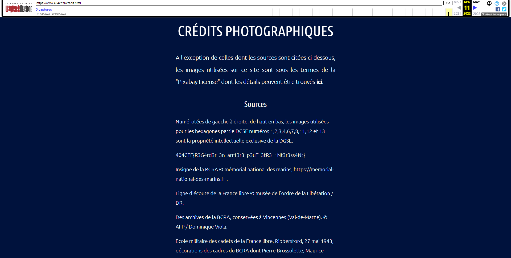

# Collaborateur Suspect

## Contexte

>Nous avons eu vent d'une activité étrange qui aurait lieu sur la page qui mène à cette interface de mission.  
Nous soupçonnons une tentative de la part de Hallebarde de nous discréditer, ils nous ont peut-être infiltrés.  
Des informations confidentielles auraient été brièvement diffusées avant d'être retirées.  
Pourriez-vous nous dire lesquelles ?  
_**Auteur : mh4ckt3mh4ckt1c4s#0705**_

## Résolution

Dans l'énoncé nous comprenons qu'il faut faire un retour dans le temps pour pouvoir observer les modifications.   

Pour cela, nous pouvons donc utiliser l'outil [WaybackMachine](https://web.archive.org/).    

En cherchant un petit peu sur l'historique de toutes les pages du site 404 ctf.fr, nous trouvons [cette page](https://web.archive.org/web/20220411084948/https://www.404ctf.fr/credit.html) où il y a le flag.

  

 **Le flag est :** `404CTF{R3G4rd3r_3n_arr13r3_p3uT_3tR3_1Nt3r3ss4Nt} `
